## 自我介绍

- 职业：中科院生态中心在读博士
- 专业：环境科学
- 研究方向：环境分析与毒理
- R龄：3年

## 问题描述

- 发生了一件事，如何定量描述它的影响力？
    
    - 描述性统计

- 我们能从影响力中得到什么？

    - 统计推断

## 影响力的描述

- 事件的网络描述

    - 新闻
    - 关键词

- 事件信息的出现，复制与再生

    - 出现意味着新闻播报，推送（被动）与浏览点击评论（主动）
    - 复制意味着转发与传播路径
    - 再生意味着基于第一次新闻的二次创作，信息解读与注释

## 类比文献计量学

- 谷歌PR值的来源：文献引文分析

- [文献计量学三定律](http://zh.wikipedia.org/wiki/%E6%9B%B8%E7%9B%AE%E8%A8%88%E9%87%8F%E5%AD%B8)

    - 布拉德福定律: 特定学科之最相关文献集中于少数的核心期刊之中
    - 洛特卡定律: 发现发表n篇论文的作者总数，是发表一篇论文作者总数的n平方分之一
    - 齐普夫定律: 发现字词的使用次数（f）与字词的使次数排名（r）之乘积，会等于常数C

- 类比网络事件

    - 网络事件一般出现在最主流平台（核心期刊）：百度，微信，微博，淘宝
    - 网络大V把持话语权，作者群长尾
    - 检索时避开高频词可有效屏蔽干扰
    
## 类比流行病学

- 三间分布

    - 时间：疾病的潜伏期，发病期，稳定期与恢复期
    - 空间：疾病的地域分布及其与地理因素间关系
    - 人群间：患者的共性与特性及与对照组的区别联系
    
- 类比网络事件

    - 时间：信息基线，高峰，衰减，基线回归
    - 空间：地域搜索量与传播渠道
    - 人群间：搜索人群的特征信息

## 影响力测算工具

- 搜索量
    
    - [百度指数](http://index.baidu.com/)
    - [谷歌趋势](http://www.google.com/trends/)
    - [微指数](http://data.weibo.com/index)
    - [淘指数](http://shu.taobao.com/)
    - [好搜指数](http://index.haosou.com/)

- 传播行为

    - [北京大学 PKUVIS 微博可视分析工具](http://vis.pku.edu.cn/weibova/weiboevents/)
    - [微信公众号后台](https://mp.weixin.qq.com/)

## 关键词选择

- 报告全文提取高频词（失败）
    - 工具：http://timdream.org/wordcloud/
    - [wordcloud包](http://cran.r-project.org/web/packages/wordcloud/index.html)

- 专业词汇：褐煤  PM10 12306
- 热点词汇：PM2.5 柴静 环保部 空气净化器

### Tips

- 掌握但不迷信工具
- 关键词选择要依赖专业知识，减少偏误
- 关键词要有识别度

## 时间分布

### 遗忘曲线与重复

- 为何柴静与崔永元都选择两会前放纪录片？
- 羊羊羊广告

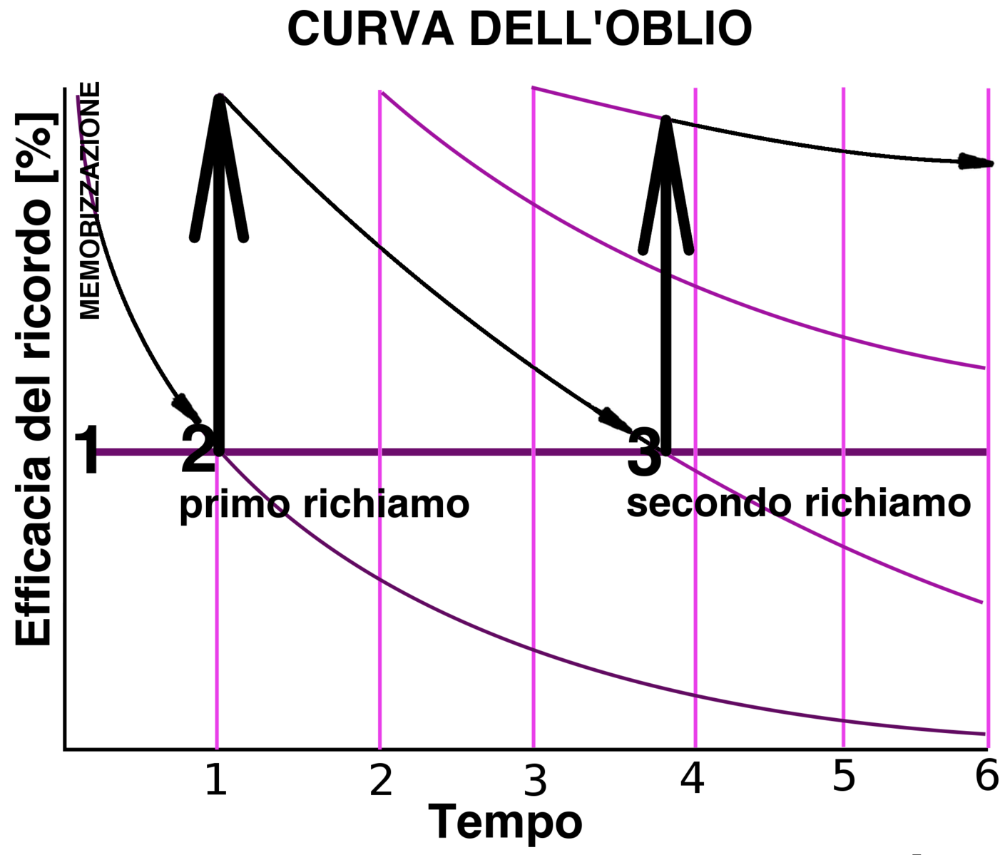

### 事件持续时间

- 专业词汇回归**基线**

- 百度指数

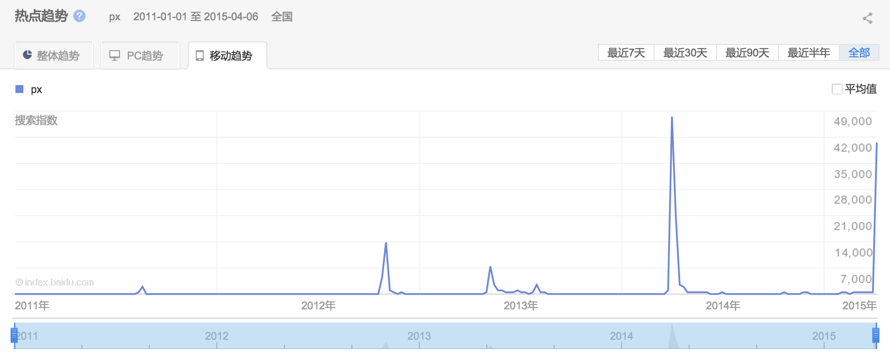

- 微指数

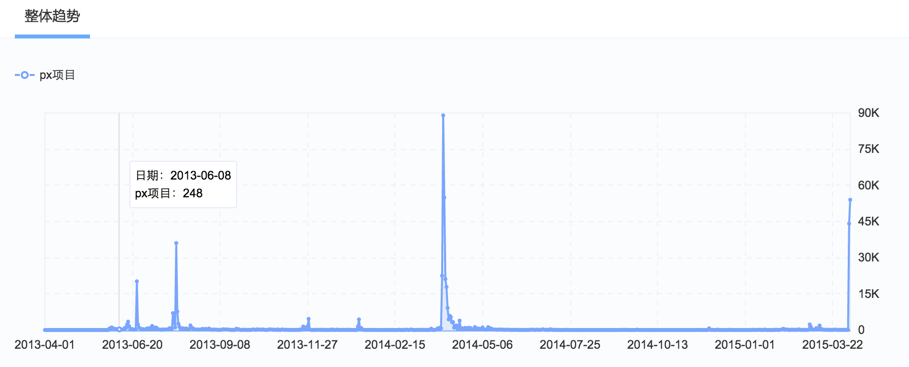

- 基线的提升表明影响的持续存在

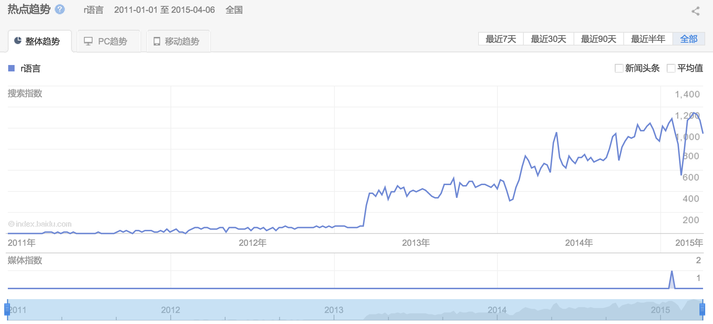

### 等峰形类比

- 等峰形事件往往持续时间成比例

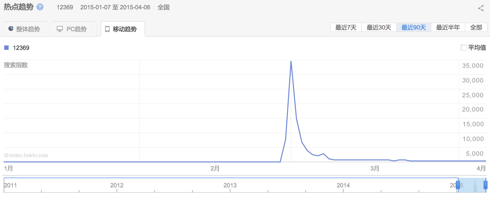

## 空间分布

### 搜索地域选择

- 降水异常导致雨伞搜索指数的变化

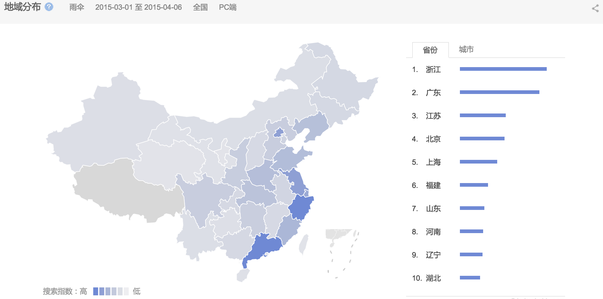

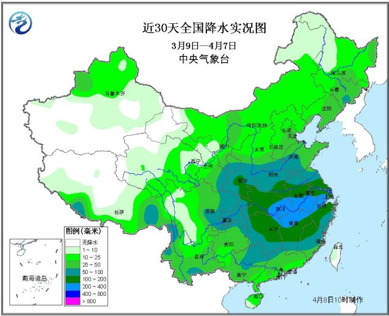

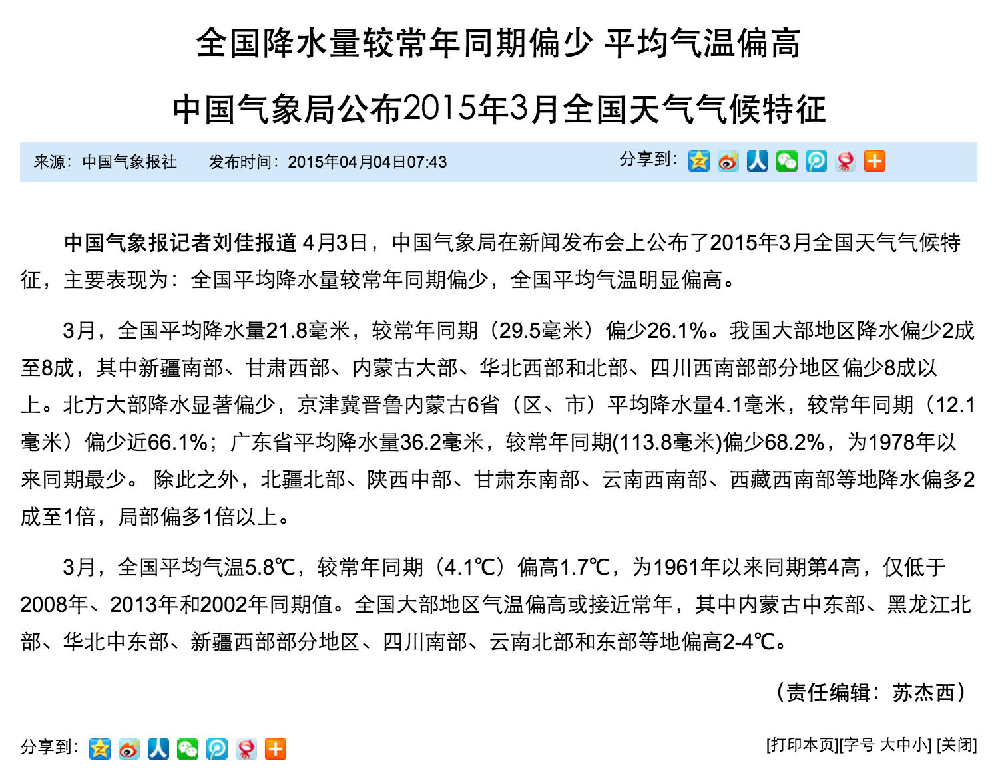

### 常见干扰

- 经济发达程度（内生）
- 地域使用习惯（工具）
- 专业知识

## 人群间分布

### 人群画像（年龄 性别 兴趣爱好）

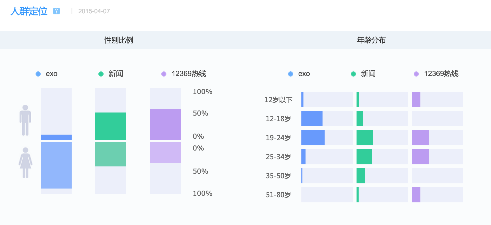

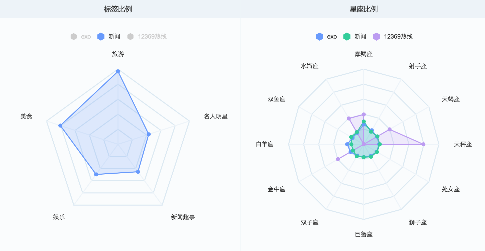

###工具偏差与基线

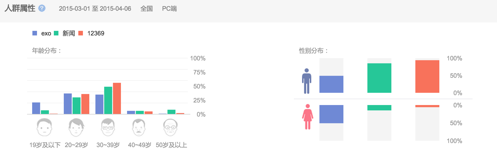

## 媒体的作用

- 新闻事件媒体高峰提前于搜索高峰(px项目)

- SNS事件媒体高峰晚于搜索高峰(穹顶之下)

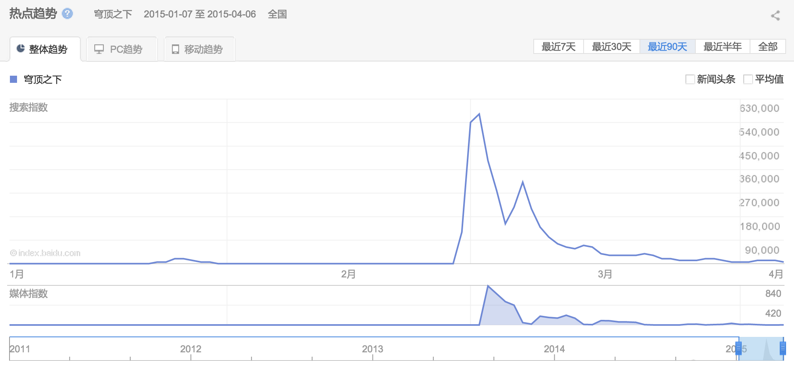

## 手机端与PC端

- 快消时代

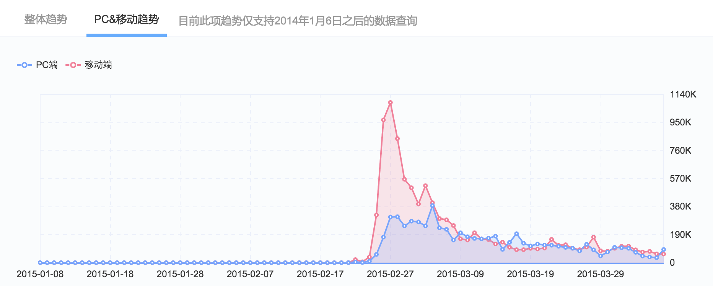

- 峰宽背后的暗示

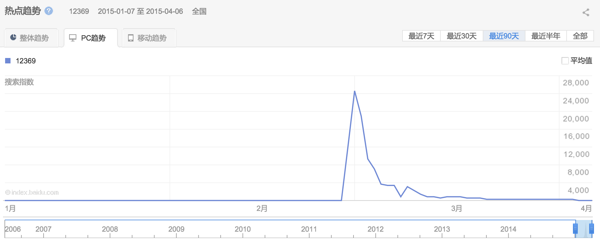

## 信息传播路径

### 长尾理论、利基人群与网络分析

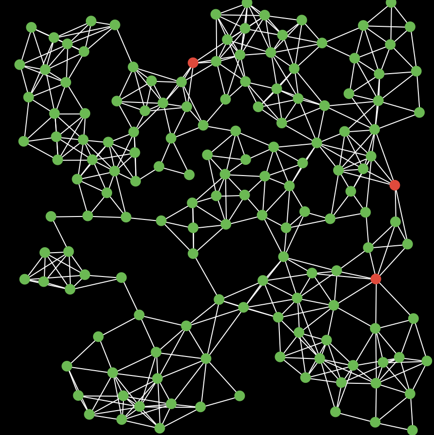

## 信息反馈

- 定向与合作传播 
- 持续传播
- 文本优化
- 商业营销

## 其他案例

- [google flu](https://www.google.org/flutrends/)
- [百度迁徙](http://qianxi.baidu.com/)
- [新浪微博签到数据](http://www.thinkgis.cn/public/sina/)
- [微博用户影响力评价的H-Index指数](http://cos.name/2013/04/weibo-influence-hindex/)
- [微博名人那些事儿](http://cos.name/2013/08/something_about_weibo/)
- [粉丝地图的可视化](http://cos.name/2013/06/weibo-fans-map-visualization/)

## 个人经验

- 不论时间，空间还是人群考察，必须设定基线，否则无法对比
- 区别传统媒体与社交媒体：前者的受众偏被动，转发可能小；后者受众偏主动，转发可能大，用户年龄等与前者有明显区别
- 注意移动端与PC端的三间差异区别，移动端将是主流
- 类比思想很重要，站在别人的肩上看世界
- 数据上垃圾进垃圾出，关键词的选择要有可检验的假设

## 谢谢

- 数据就在身边！
- 工具使用参考工具官方主页的帮助文档
- 有疑问欢迎[联系](mailto:yufreecas@gmail.com)[我](http://yufree.cn)
